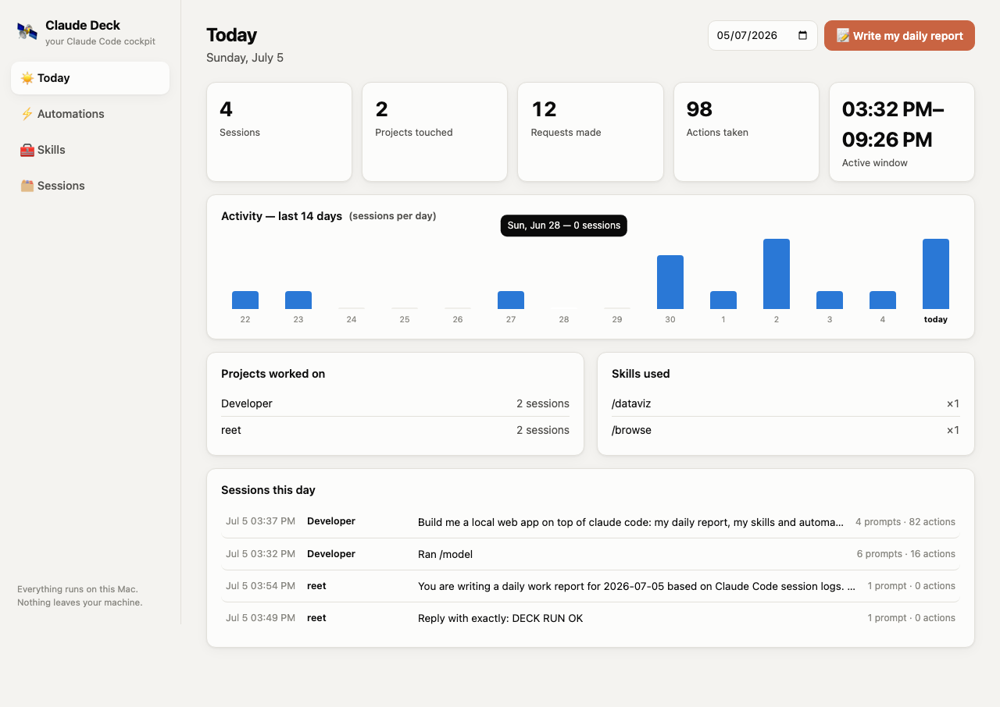
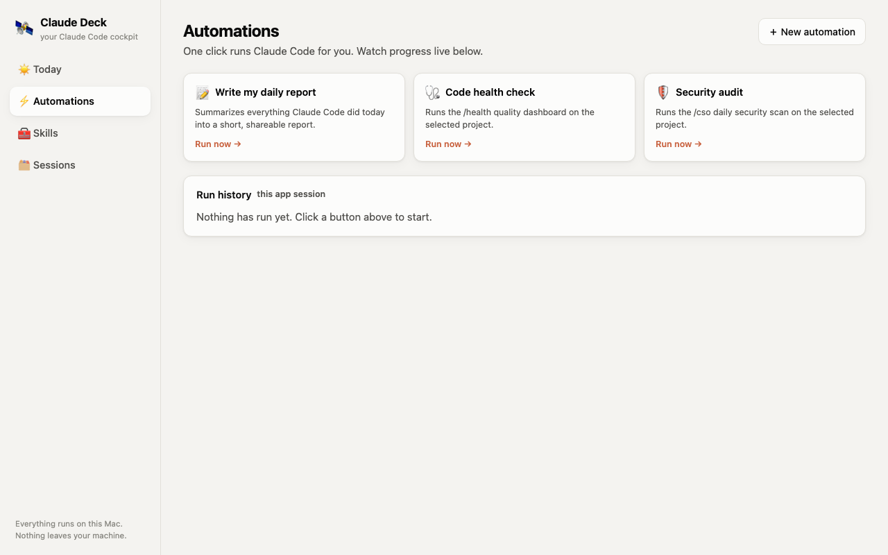
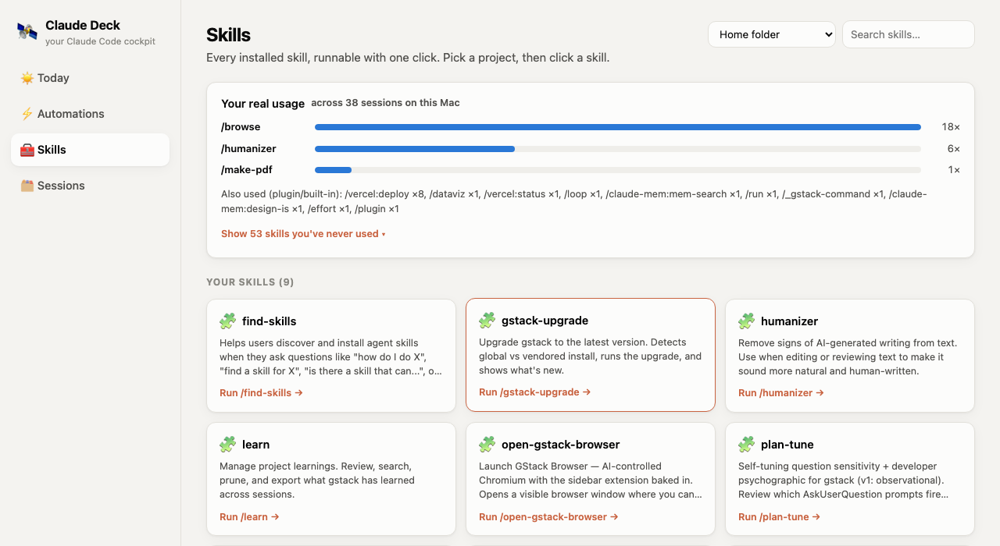

# Claude Deck 🛰️

A local dashboard for [Claude Code](https://claude.com/claude-code). Built for
teammates who never touch a terminal — and for personal daily use.

Everything below is real: real session data, real skill-usage stats, real
screenshots. There's no mock mode.



- **Today** — a daily report: sessions, projects touched, requests, actions,
  a 14-day activity chart, and a one-click AI-written narrative summary.
- **Automations** — one-click buttons that run Claude Code for you
  (daily report, health check, security audit, plus any you add).
- **Skills** — every installed skill as a runnable button, plus a real
  usage panel showing which skills you actually use vs. which you've never
  touched.
- **Sessions** — a searchable log of every Claude Code session, with full
  readable transcripts (you ↔ Claude, with the actions it took).

<table>
<tr>
<td></td>
<td></td>
</tr>
</table>

## Start it

Double-click **`Claude Deck.command`**. That's it — it opens
<http://localhost:4747> in your browser.

Terminal folks:

```bash
git clone https://github.com/reetbatra/claude-deck.git
cd claude-deck
node server.js --open
```

Requires Node 18+ and the [Claude Code CLI](https://claude.com/claude-code)
already installed and logged in.

## Why local-only

The dashboard reads `~/.claude/projects/*.jsonl` (your real session
transcripts) and spawns your local `claude` binary to run automations. That
only works on your own machine — there's no server to deploy this to that
would give it the same access without also giving a public website control
of your laptop. So this stays local by design; nothing is uploaded anywhere.

## How it works

- Zero dependencies — Node 18+ built-ins only. No `npm install`.
- Reads (never writes) `~/.claude/projects/*.jsonl` transcripts and
  `~/.claude/skills/*/SKILL.md`.
- One-click runs spawn `claude -p "<prompt>"` headlessly; output streams
  live into the page. Runs default to safe permissions; each automation can
  opt into "allow edits" or "full access".
- Binds to `127.0.0.1` only. Nothing leaves your machine.

## Files

| Path | What |
|---|---|
| `server.js` | The whole backend (~650 lines, zero deps) |
| `public/` | The UI (vanilla HTML/CSS/JS) |
| `data/automations.json` | Your custom one-click buttons (gitignored — created on first run) |
| `data/runs/` | Logs from one-click runs (gitignored) |
| `data/session-cache.json` | Parsed-session cache, safe to delete (gitignored) |

## License

MIT
